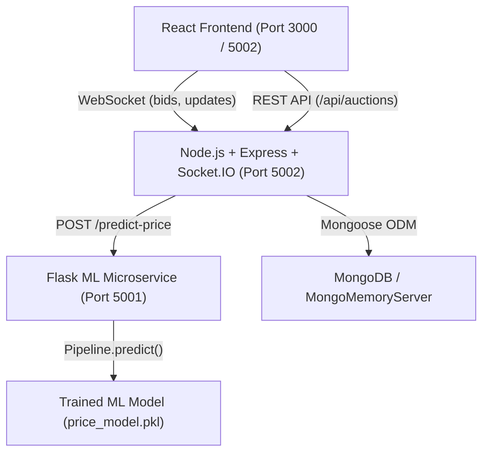

# Real-Time Bidding Platform with ML-Based Price Prediction

A production-grade, full-stack real-time auction web application featuring live bidding via Socket.IO and instantaneous final price forecasting driven by a Scikit-Learn Machine Learning model served through a Python Flask microservice.

---

## Architecture Overview



---

## Tech Stack

- **Frontend**: React (Vite), Socket.IO Client, Lucide Icons, Modern responsive design system with live countdowns and dynamic ML prediction gauge.
- **Backend**: Node.js, Express, Socket.IO, Mongoose, Axios. Includes automatic `mongodb-memory-server` fallback so no external database installation is required.
- **ML Microservice**: Python, Flask, Flask-CORS, Joblib.
- **ML Pipeline**: Scikit-Learn (One-Hot Preprocessing, Linear Regression, Random Forest, Gradient Boosting Regressor).

---

## Directory Structure

```
Real-Time Bidding Platform with ML-Based Price Prediction/
├── ml_training/
│   ├── generate_data.py       # Phase 1: Realistic synthetic dataset generator
│   ├── auction_data.csv       # Phase 1: Generated 2,500-record dataset
│   ├── train_model.py         # Phase 2: EDA, Pipeline training, model evaluation
│   └── price_model.pkl        # Phase 2: Serialized best-performing ML pipeline
├── ml_service/
│   ├── app.py                 # Phase 3: Flask microservice (port 5001)
│   ├── requirements.txt       # Phase 3: Python dependencies
│   ├── test_predict.py        # Phase 3: Verification script
│   └── price_model.pkl        # Serialized pipeline loaded by Flask
├── backend/
│   ├── server.js              # Phase 4: Express + Socket.IO server (port 5002)
│   ├── config/db.js           # Phase 4: MongoDB / in-memory connection manager
│   ├── models/
│   │   ├── User.js            # User Mongoose schema
│   │   ├── Auction.js         # Auction Mongoose schema
│   │   └── Bid.js             # Bid record schema
│   ├── routes/
│   │   └── auctionRoutes.js   # REST API & Socket.IO event broadcaster
│   ├── services/
│   │   └── mlClient.js        # Safe HTTP client to Flask with offline fallback
│   └── seed.js                # Initial mock auction listings and bids
├── frontend/
│   ├── src/
│   │   ├── App.jsx            # Main app with real-time Socket.IO listeners
│   │   ├── components/
│   │   │   ├── Navbar.jsx     # Header with connection status indicator
│   │   │   ├── AuctionCard.jsx# Homepage card with timer and ML badge
│   │   │   ├── AuctionDetail.jsx # Detail view with ML gauge & live bid stream
│   │   │   └── CreateAuctionModal.jsx # Auction listing modal
│   │   ├── utils/formatters.js# Countdown and currency formatting helpers
│   │   └── styles/index.css   # Modern dark-accented theme & animations
│   ├── vite.config.js         # Vite configuration with backend proxy
│   └── package.json
├── start_all.sh               # One-click runner for all three services
├── package.json               # Root scripts
└── README.md
```

---

## Model Evaluation Results (Phase 2)

Evaluated on 500 held-out test auction records from `auction_data.csv`:

| Model | MAE ($) | RMSE ($) | $R^2$ Score |
| :--- | :--- | :--- | :--- |
| **Gradient Boosting (Best)** | **$33.63** | **$53.70** | **0.9939** |
| Random Forest | $44.03 | $72.23 | 0.9890 |
| Linear Regression (Baseline) | $81.09 | $122.53 | 0.9683 |

**Features used**:
- `item_category`: Categorical (`Electronics`, `Collectibles`, `Fine Art`, `Jewelry`, `Fashion`, `Home & Garden`)
- `starting_price`: Numeric baseline price
- `num_bidders`: Numeric count of competitive bidders
- `auction_duration_hours`: Numeric duration (12h, 24h, 48h, 72h, 168h)
- `time_of_day_listed`: Categorical (`Morning`, `Afternoon`, `Evening`, `Night`)

---

## Quick Start (Run All Services)

### Option 1: One-Click Script
Run the automated orchestration script from the project root:
```bash
./start_all.sh
```
This automatically boots:
- **ML Service** on `http://localhost:5001`
- **Backend API & Socket.IO** on `http://localhost:5002`
- **Frontend UI** on `http://localhost:3000`

---

### Option 2: Run Services Individually

#### 1. ML Prediction Service (Port 5001)
```bash
# Setup virtual environment
python3 -m venv venv
./venv/bin/pip install -r ml_service/requirements.txt

# Run Flask microservice
./venv/bin/python3 ml_service/app.py
```

#### 2. Backend Server (Port 5002)
```bash
cd backend
npm install
node server.js
```
*(Note: If a local MongoDB instance is not detected, an in-memory database will start automatically and seed initial items!)*

#### 3. Frontend Development Server (Port 3000)
```bash
cd frontend
npm install
npm run dev
```

---

## API Endpoints

### ML Service (`http://localhost:5001`)

#### `GET /health`
Returns service status and loaded model details.

#### `POST /predict-price`
Calculates final price prediction for an item.
```json
// Request
{
  "item_category": "Electronics",
  "starting_price": 200.0,
  "num_bidders": 6,
  "auction_duration_hours": 24,
  "time_of_day_listed": "Evening"
}

// Response
{
  "item_category": "Electronics",
  "num_bidders": 6,
  "predicted_price": 346.26,
  "starting_price": 200.0,
  "status": "success"
}
```

---

### Backend API (`http://localhost:5002`)

| Method | Endpoint | Description |
| :--- | :--- | :--- |
| `GET` | `/health` | Backend and database health check |
| `GET` | `/api/auctions` | List all auctions (supports `?category=...`) |
| `GET` | `/api/auctions/:id` | Get single auction with complete bid history |
| `POST` | `/api/auctions` | Create new auction (automatically triggers initial ML forecast) |
| `POST` | `/api/auctions/:id/bid` | Place a bid (validates bid > current, updates ML forecast, broadcasts via Socket.IO) |

---

## Real-Time Socket.IO Events

| Event Name | Direction | Payload | Description |
| :--- | :--- | :--- | :--- |
| `new_bid` | Server -> Clients | `{ auctionId, currentBid, highestBidder, numBidders, predictedPrice, bid }` | Broadcast immediately when any user places a bid |
| `auction_updated` | Server -> Clients | `Auction` document | Broadcasts the updated auction document |
| `auction_created` | Server -> Clients | `Auction` document | Broadcasts newly listed auction to all active users |

---

## Fault Tolerance & Graceful Fallback

The backend includes a resilient circuit breaker wrapper around the ML service in [`backend/services/mlClient.js`](file:///Users/srajankumar/Desktop/Real-Time%20Bidding%20Platform%20with%20ML-Based%20Price%20Prediction/backend/services/mlClient.js):
- **Short Timeout**: 2-second timeout prevents slow ML calls from blocking bidding.
- **Graceful Fallback**: If the Flask service is stopped or unreachable, the system logs a non-fatal warning and applies an algorithmic fallback estimate.
- **Continuous Operation**: Live bidding and real-time Socket.IO broadcasts continue without interruption.

---

## Verification & Testing

### 1. Test Dataset Generation
```bash
./venv/bin/python3 ml_training/generate_data.py
```

### 2. Test Model Training & Evaluation
```bash
./venv/bin/python3 ml_training/train_model.py
```

### 3. Test ML Service Directly
```bash
./venv/bin/python3 ml_service/test_predict.py
```

### 4. Test Live Bidding & Real-Time Broadcast
```bash
# In one terminal, ensure services are running, then test via curl:
curl -X POST http://127.0.0.1:5002/api/auctions/<AUCTION_ID>/bid \
  -H "Content-Type: application/json" \
  -d '{"amount": 1300, "bidderName": "Test Bidder", "userId": "test-user-1"}'
```
